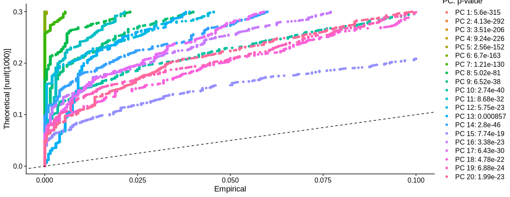

## Normalize by sequence depth
Seurats defaults are suitable to check the cell cycle phase before moving on to methods to create the cell clusters.  

    # Perform log-normalize on the counts by sequence depth
    seuratObject <- 
      NormalizeData(
        seuratObject, 
        normalization.method = "LogNormalize", 
        scale.factor = 10000
        )

## Identification of highly variable features
Using Principal Component Analysis (PCA) to determine if cell cycle is a major source of variation in the dataset.  Seurat will find the most variable features.  Next, the data should be scaled.  The data is scaled based on expression level so that the mean expression of each gene is 0 and variance across cells scaled to be 1.  This is achieved by using **selection.method "vst"**  

    # find the most variable features
    seuratObject <- FindVariableFeatures(
      seuratObject,
      selection.method = "vst",
      nfeatures = 2000,
      verbose = F
      )
    
    # scale the dataset
    seuratObject <- ScaleData(
      seuratObject,
      verbose = F
      )

The `FindVariableFeatures` returns 2000 features per sample and will be used in the principal component analysis later.  The variable features can be plotted with the included `VariableFeaturePlot` function.  

    top10 <- head(VariableFeatures(seurat_feat), 10)
    
    LabelPoints(
      VariableFeaturePlot(seuratObject), 
      top10, 
      repel = T,
      ynudge = 0,
      xnudge = 0)
    


### Identifying the significant PCs
(The following is from [github.com/hbctraining](https://github.com/hbctraining/scRNA-seq/blob/master/lessons/07_SC_clustering_cells_SCT.md#clustering-cells-based-on-top-pcs-metagenes))
To overcome the extensive technical noise in the expression of any single gene for scRNA-seq data, **Seurat assigns cells to clusters based on their PCA scores derived from the expression of the integrated most variable genes**, with each PC essentially representing a "metagene" that combines information across a correlated gene set. **Determining how many PCs to include in the clustering step is therefore important to ensure that we are capturing the majority of the variation**, or cell types, present in our dataset.
It is useful to explore the PCs prior to deciding which PCs to include for the downstream clustering analysis.  

(a) One way of exploring the PCs is using a heatmap to visualize the most variant genes for select PCs with the  **genes and cells ordered by PCA scores**. The idea here is to look at the PCs and determine whether the genes driving them make sense for differentiating the different cell types.  

The  `cells`  argument specifies the number of cells with the most negative or postive PCA scores to use for the plotting. The idea is that we are looking for a PC where the heatmap starts to look more "fuzzy", i.e. where the distinctions between the groups of genes is not so distinct.   

    seuratObject <- 
      RunPCA(
        seuratObject, 
        features = VariableFeatures(object = seuratObject))

   

    # Explore heatmap of PCs
    DimHeatmap(
          seuratObject, 
          dims = 1:9, 
          cells = 500, 
          balanced = T)
        
    DimHeatmap(
          seurat_feat, 
          dims = 10:18, 
          cells = 500, 
          balanced = T)


Another method we can use to visualize the PC's is to print out the top positive and negative genes by PCA score.  

    # Printing out the most variable genes driving PCs
    print(
      seuratObject[["pca"]], 
      dims = 1:12, 
      nfeatures = 5)
|||
|:-----|:-------------------------------------------------| 
|PC_1 Positive:  | ACT.1, RS2.2, COX3.2, A33.3, LEG4.1 
|PC_1 Negative:  | HBB2.1, FRIL.1, HBB1, HBA2, DYH3.1 
|PC_2 Positive:  | ACT, S10AA, HSP7C.4, CD63, LEG4 
|PC_2 Negative:  | DYH3.1, RL36.1, HBB1, RS27A.2, RS30 
|PC_3 Positive:  | C1QB, C1QC, LG3BP, GI24, CY24B 
|PC_3 Negative:  | S100P.1, SPB5, S100P, CLD7, CAN9 
|PC_4 Positive:  | UCP2.1, GSTP1.2, K1C4, VATL.1, MPEG1.4 
|PC_4 Negative:  | DERM, ATL3, EDNRA, LUM, APOH 
|PC_5 Positive:  | ANX12, CADHB, RIHA, ANXA1.4, AVR4.1 
|PC_5 Negative:  | MSLN.2, OTOG.4, SCEL.1, S10A4, MUC4.2 
|PC_6 Positive:  | ANX12, TGM3.3, AVR4.1, RIHA, SCEL 
|PC_6 Negative:  | CAV1.1, VWF, ETS1, PLVAP, VGFR2 
|PC_7 Positive:  | MPEG1.4, YLAT1, PCP.1, GRN, CNOT8.1 
|PC_7 Negative:  | HBB2.2, HEM3.1, POL2.992, PLBL1.3, CAMP.2 
|PC_8 Positive:  | CO3A1, CO1A1, TENA.1, CO5A1.2, CO6A3.3 
|PC_8 Negative:  | VWF, PLVAP, BCL6, ETS1, GBG1 
|PC_9 Positive:  | CCL5, CD3E, TCA, TNFC, TCB.1 
|PC_9 Negative:  | FRIL.2, HEM3.1, HBB2.2, FRIH, GSTP1.2 
|PC_10  Positive: | GP2.3, DEN2A.2, STAP2, UROM.9, FRK 
|PC_10 Negative:  | K1C17, AVR4, K1C24, TGM3.2, PINLY.2 
|PC_11 Positive:  | CAMP.4, PGFRA, TETN, SLIT1, THYG.3 
|PC_11 Negative:  | DREB.1, CTHR1.1, K2C8, COBA1.2, CALM.6 
|PC_12 Positive:  | ATS4, TBB1, TSG6, LRN4L, SCHI1 
|PC_12 Negative:  | VWA1, SDPR.1, CO4A2, KHDR3, FGFR4 


(b) The  **elbow plot**  is another helpful way to determine how many PCs to use for clustering so that we are capturing majority of the variation in the data. The elbow plot visualizes the standard deviation of each PC, and we are looking for where the standard deviations begins to plateau. Essentially,  **where the elbow appears is usually the threshold for identifying the majority of the variation**. However, this method can be quite subjective.  

Let's draw an elbow plot using the top 40 PCs:  

    # Plot the elbow plot
    ElbowPlot(seuratObject, 
              ndims = 40)


This is difficult to read.  The target is where the plateau begins to climb as the PC line approaches 0.  It looks to be anywhere between 20 and 11.  I think this can be improved on with a better visualization.  
## Calculate how many PCs to use
We can rank the PCs by comparing the percent of variation associated with each PC with it's adjacent PC with the equation:  


$$
\%\:of\: PC\:variation  = \frac{\sigma} {\sum\sigma}\:\times\:100
$$

    # Determine percent of variation associated with each PC

    pct <- seuratObject[["pca"]]@stdev / sum(seuratObject[["pca"]]@stdev) * 100
        
    # Calculate cumulative percents for each PC
    cumu <- cumsum(pct)
    
    # Determine which PC exhibits cumulative percent greater than 90% and % variation associated with the PC as less than 5
    co1 <- which(cumu > 90 & pct < 5)[1]
    
    co1
    
    # Determine the difference between variation of PC and subsequent PC
    co2 <- sort(which((pct[1:length(pct) - 1] - pct[2:length(pct)]) > 0.1), decreasing = T)[1] + 1
    
    # last point where change of % of variation is more than 0.1%.
    co2
    
    # find the minimum of the two calculation
    pcs <- min(co1, co2)
    
pcs has a value of 17, which is in line with the earlier elbow plot.  We can plot a new elbow with this calculation.  
    
    # Create a dataframe with values
    plot_df <- data.frame(pct = pct, 
                                  cumu = cumu, 
                                  rank = 1:length(pct))
        
        # Elbow plot to visualize 
    ggplot(plot_df, aes(cumu, pct, label = rank, color = rank > pcs)) + 
      geom_text() + 
      geom_vline(xintercept = 90, color = "grey") + 
      geom_hline(yintercept = min(pct[pct > 5]), color = "grey") +
      theme_bw()


A Jackstraw plot provides a visualization tool for comparing the distribution of p-values for each PC with a uniform distribution (dashed line). ‘Significant’ PCs will show a strong enrichment of features with low p-values (solid curve above the dashed line). In this case it appears that there is not much of a drop off even with the first 20 PCs.  

    seuratObject <- JackStraw(seuratObject, num.replicate = 100)
    seuratObject <- ScoreJackStraw(seuratObject, dims = 1:20)
    JackStrawPlot(seuratObject, dims = 1:20)


These different methods of calculating which PCs are most significant all suggest that the first 17 PCs should be used to calculate the clusters.  

However, if SCTransform from Satija lab is used you would want to use all 40 PCs.  More on that later.  

## Clustering the cells
    # Determine the K-nearest neighbor graph
    seurat_cluster <- FindNeighbors(
      seurat_feat, 
      dims = 1:17)
    
    # Determine the clusters for various resolutions                                
    seurat_cluster <- FindClusters(
      seurat_cluster,
      resolution = 0.5,
      n.start = 1000)

## Segregation of clusters by sample
We can begin exploring the distribution of cells per cluster in each sample by extracting the identity and sample information from the Seurat object.  This will tell us the number of cells per cluster per sample.  

    # Extract identity and sample information from seurat object to determine the number of cells per cluster per sample
    n_cells <- 
      FetchData(seuratObject,
                vars = c("ident", "seq_folder")) %>%
      dplyr::count(ident, seq_folder) %>%
      tidyr::spread(ident, n)
    
    # View table
    View(n_cells)

seq_folder | 0 | 1 | 2 | 3 | 4 | 5 | 6 | 7 | 8
|:--:|:--:|:--:|:--:|:--:|:--:|:--:|:--:|:--:|:--:|
 limb_14dpa | NA | NA | 30 | NA | 47 | NA | NA | NA | 28
 limb_3dpa | 581 | 571 | NA | 71 | NA | 54 | 7 | NA | NA
 limb_intact | 44 | 27 | NA | 19 | NA | 2 | 1 | NA | NA
 spine_14dpa | NA | NA | 148 | NA | 65 | NA | NA | 35 | 1
 spine_3dpa | 4 | 1 | NA | 9 | NA | 6 | 44 | NA | NA
 spine_intact | 6 | 2 | NA | 32 | NA | NA | 1 | NA | NA

This generated table has some interesting details.  Clearly it shows that there is not much data in this dataset.  It leans heavily towards the limb 3dpa and spine 14dpa samples.  But even with the sparsity is does show some things of interest.  Particularly the cluster 7 and 8 are unique to 14dpa time point and that the spine 14dpa has 1 cell in the 8th cluster.  I will explore this later to see if perhaps the cell type may be something that is shared between spine and limb. This table also indicates that there are 8 clusters across the entire dataset.  

## Visualizing the cluster data
We will focus on three ways to visualize the datas in the single cell spine comparison.  Uniform Manifold Approximation and Projection (UMAP) is a novel method for dimension reduction and visualization. t-Distributed Stochastic Neighbor Embedding (tSNE) and Principal Component (PCA) are other techniques for dimensional reduction and visualization.  Our data is sparse to begin with and a side-by-side comparison of the three techniques allows us to determine that t-Distributed technique was best.  

I will host a workshop in the coming weeks to go over these three techniques in detail to show the differences in how these they are calculated and why they look so different.  

    # run UMAP
    seuratObject <- RunUMAP(
      seuratObject, 
      dims = 1:17)
    
    # run TSNE
    seuratObject <- RunTSNE(
      seuratObject,
      dims.use = 1:17, 
      reduction.use = "pca")
    
    # plot pca
    DimPlot(seuratObject, 
            reduction = "pca",
            dims = c(1, 2),
            label = T,
            label.size = 6)
            
    # Now let us visualize the data clusters side by side using different methods
    umap <- 
      DimPlot(seuratObject, 
            reduction = "umap",
            label = T,
            label.size = 6) & 
      ggtitle(label = "UMAP")
    
    tsne <- 
      DimPlot(seuratObject, 
              reduction = "tsne",
              label = T,
              label.size = 6) & 
      ggtitle(label = "tSNE")
    
    pca <- 
      DimPlot(seuratObject, 
              reduction = "pca",
              label = T,
              label.size = 6) & 
      ggtitle(label = "PCA")
    
    (umap + tsne + pca) &
      NoLegend()


These cluster graphs are a representation of the merged Seurat object and show the combined clusters over all of the tissue samples and timepoints.  They can be broken down by subsetting the object.  It is much easier to analyze the dataset while merged.  
# Identifying the clusters
We begin the process of identifying the clusters by curating a list of all of the markers per cluster identified by the principal components.  

    # First we need to identify the most conserved markers across the entire dataset.
    markers <- 
      FindAllMarkers(
        object = seuratObject,
        only.pos = TRUE,
        logfc.threshold = 0.25,
        assay = NULL,
        features = NULL,
        test.use = "wilcox",
        slot = "data",
        min.pct = 0.1,
        min.diff.pct = -Inf,
        max.cells.per.ident = Inf,
        node = NULL,
        verbose = TRUE,
        random.seed = 1,
        latent.vars = NULL,
        min.cells.feature = 3,
        min.cells.group = 3,
        pseudocount.use = 1,
        return.thresh = 0.01)
Looking at the top of the list.
```
head(markers,3)
```


||p_val | avg_logFC | pct.1 | pct.2  |  p_val_adj | cluster |gene
|:--:|:--:|:--:|:--:|:--:|:--:|:--:|:--:|:--:|
GSTP1.4 | 1.015519e-80 | 0.6311041 | 0.976 | 0.601 | 2.349809e-76 | 0 | GSTP1
FRIH.1  | 1.246516e-71 | 0.6560862 | 0.964 | 0.600 | 2.884313e-67 | 0 |  FRIH
FRIL.1  | 1.441648e-63 | 0.6143943 | 0.997 | 0.764 | 3.335830e-59 | 0 |  FRIL

```
# Reorder the clusters by cluster number, while also rearranging the columns for readability
markers <- markers[ , c(6, 7, 2:4, 1, 5)]

markers <- markers %>%
  dplyr::arrange(cluster, p_val_adj)
head(markers,3)
```
||cluster | gene| avg_logFC | pct.1 | pct.2 | p_val | p_val_adj
|:--:|:--:|:--:|:--:|:--:|:--:|:--:|:--:|:--:|
PDPFL     |   0 |  PDPFL | 0.2519058 | 0.427 | 0.246 | 5.385759e-15 | 1.246211e-10
NTCP4     |   0 |  NTCP4 | 0.2527116 | 0.737 | 0.485 | 2.320215e-18 | 5.368747e-14
RL10.1    |   0 |  RL10 | 0.2530873 | 0.984 | 0.677 | 9.949638e-26 | 2.302247e-21

We can add the Uniprot ID and contig information to help identify these markers better.  

```
markers <- markers %>%
  dplyr::arrange(cluster, avg_logFC)
    
top10_markers_by_cluster <- markers %>%
  group_by(cluster) %>%
    top_n(n = 10,
    wt = avg_logFC)
    
top10_markers_by_cluster$homolog_ID <- 
  top10_markers_by_cluster$gene
    
top10_markers_by_cluster <- 
  left_join(top10_markers_by_cluster, 
  gene_annotation,"homolog_ID")
```
## Cluster 0 - hemocytoblasts
The top ten markers in cluster 0 are GSTP1, FRIH,FRIL, FRIL, BRCA, HEM3, SQSTM, and HBB2 Which mainly point to light and heavy ferritin transport, autophagy, and hemoglobin.  

    hemocytoblasts <- c("SQSTM", "FRIH.1", "FRIL.1", "FRIL")
    
    FeaturePlot(
      seuratObject, 
      reduction = "tsne", 
      features = hemocytoblasts)
    
    # rename cluster 0 to hemocytoblasts
    seuratObject <- 
      RenameIdents(
        object = seuratObject, 
        "0" = "hemocytoblasts")


Cluster 0 and cluster 1 both have numerous markers for erythrocytes.  Cluster 0 however contains a lot of ferritin transport and storage as well as autophagy cells.   I suspect that cluster 0 is hemocytoblasts and cluster 1 is likely erythrocytes.  

For now, I will rename cluster 0 to hemocytoblasts  
## Cluster 1

## Cluster Macrophage

```
vlnPlot(seuratObject, features = "APOEB", ncol = 1)
```

```
RidgePlot(seuratObject, features = "APOEB", ncol = 1)
```


## Cluster 8 - Fibroblast


# The annotated feature map v0.9
Now that we have a first attempt at identifying all the clusters we are able to create completed annotations of the dataset.  This is version 0.9 because I have improved my method of identification.  But let's look at the first draft.  

    DimPlot(seuratObject, 
            reduction = "tsne",
            label = T,
            label.size = 4) & 
      ggtitle(label = "scSpine all data")


     Due to the sparsity of the data the labels can actually hide the cluster.  So we can turn the labels off.
     DimPlot(seuratObject, 
            reduction = "tsne",
            label = F,
            label.size = 4) & 
      ggtitle(label = "scSpine all data")


We can again plot to compare the different dimensional reduction methods.  

    umap <- 
      DimPlot(seuratObject, 
            reduction = "umap",
            label = T,
            label.size = 4) & 
      ggtitle(label = "UMAP")
    
    tsne <- 
      DimPlot(seuratObject, 
              reduction = "tsne",
              label = T,
              label.size = 4) & 
      ggtitle(label = "tSNE")
    
    pca <- 
      DimPlot(seuratObject, 
              reduction = "pca",
              label = T,
              label.size = 4) & 
      ggtitle(label = "PCA")
    
    (umap + tsne + pca) &
      NoLegend()


We can plot the tSNE by sample type as well as by tissue.


We can plot the data side by side by timepoint for easier comparison.

    # lets look at the limb timepoints side by side
    limb_14dpa <- subset(x = seuratObject, subset = seq_folder == "limb_14dpa")
    limb_3dpa <- subset(x = seuratObject, subset = seq_folder == "limb_3dpa")
    limb_intact <- subset(x = seuratObject, subset = seq_folder == "limb_intact")
    
    tsne_limb_intact <- 
      DimPlot(limb_intact, 
              reduction = "tsne",
              label = T,
              label.size = 4) & 
      ggtitle(label = "Limb Intact")
    
    tsne_limb_3dpa <- 
      DimPlot(limb_3dpa, 
              reduction = "tsne",
              label = T,
              label.size = 4) & 
      ggtitle(label = "Limb 3dpa")
    
    tsne_limb_14dpa <- 
      DimPlot(limb_14dpa, 
              reduction = "tsne",
              label = T,
              label.size = 4) & 
      ggtitle(label = "Limb 14dpa")
    (tsne_limb_intact + tsne_limb_3dpa + tsne_limb_14dpa) &
      NoLegend()
    
    # lets look at the spine timepoints side by side
    spine_14dpa <- subset(x = seuratObject, subset = seq_folder == "spine_14dpa")
    spine_3dpa <- subset(x = seuratObject, subset = seq_folder == "spine_3dpa")
    spine_intact <- subset(x = seuratObject, subset = seq_folder == "spine_intact")
    
    tsne_spine_intact <- 
      DimPlot(spine_intact, 
              reduction = "tsne",
              label = T,
              label.size = 4) & 
      ggtitle(label = "Spine Intact")
    
    tsne_spine_3dpa <- 
      DimPlot(spine_3dpa, 
              reduction = "tsne",
              label = T,
              label.size = 4) & 
      ggtitle(label = "Spine 3dpa")
    
    tsne_spine_14dpa <- 
      DimPlot(spine_14dpa, 
              reduction = "tsne",
              label = T,
              label.size = 4) & 
      ggtitle(label = "Spine 14dpa")
    (tsne_spine_intact + tsne_spine_3dpa + tsne_spine_14dpa) &
      NoLegend()
    
    DimPlot(seuratObject, 
            reduction = "tsne",
            label = T,
            label.size = 4) & 
      ggtitle(label = "scSpine all data")


Lastly, we can plot the datasets by tissue type, all timepoints, side by side.

    scSpine <- subset(x = seuratObject, subset = tissue == "Spine")
    p2 <- DimPlot(scSpine, 
            reduction = "tsne",
            label = T,
            label.size = 4) & 
      ggtitle(label = "Spine Subset")
    
    scLimb <- subset(x = seuratObject, subset = tissue == "Limb")
    p1 <- DimPlot(scLimb, 
            reduction = "tsne",
            label = T,
            label.size = 4) & 
      ggtitle(label = "Limb Subset")
    (p1 + p2)


## Markers used to identify cluster
hemocytoblast: "SQSTM", "FRIH.1", "FRIL.1", "FRIL"
erythrocytes: "MTDC", "DYH3.1", "HBB1", "HBA2"
fibroblast: CAMP, LUM, POSTN
macrophage: APOEB, MPEG1, MARCO, 
myeloid: TREM2, MARCO, CAMP, MPEG
small secretory cells: FCGBP, OTOG, CHS1, AGR2A
fibroblast: TETN, LUM, PTX3, CO1A1, CO3A1

We can plot a dendogram relating the 'average' cell from each identity class. Tree is estimated based on a distance matrix constructed in either gene expression space or PCA space.

    small_tree <- BuildClusterTree(object = seuratObject)
    PlotClusterTree(object = small_tree)

Clearly, I need to work on the annotation.
