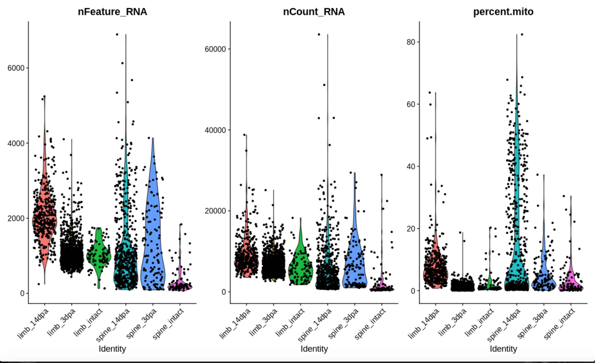
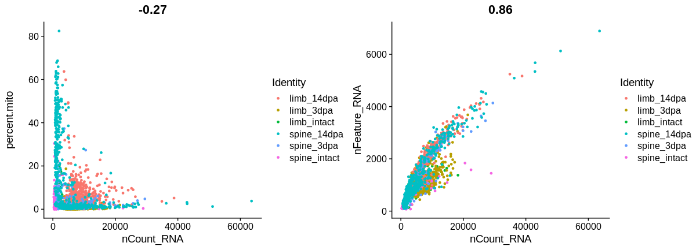
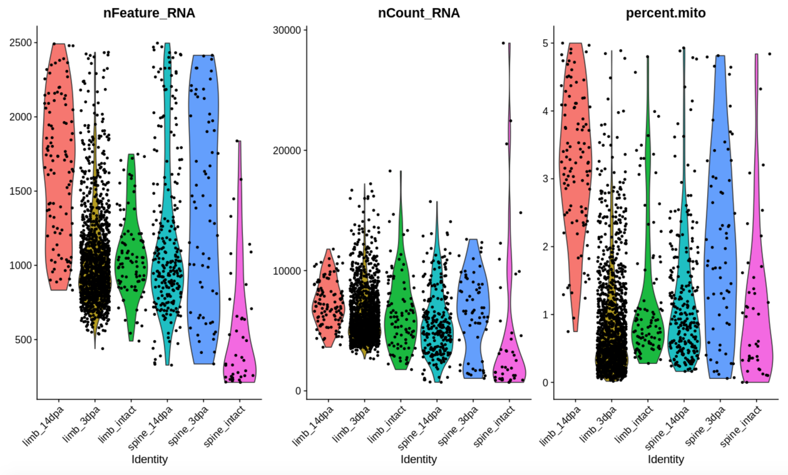
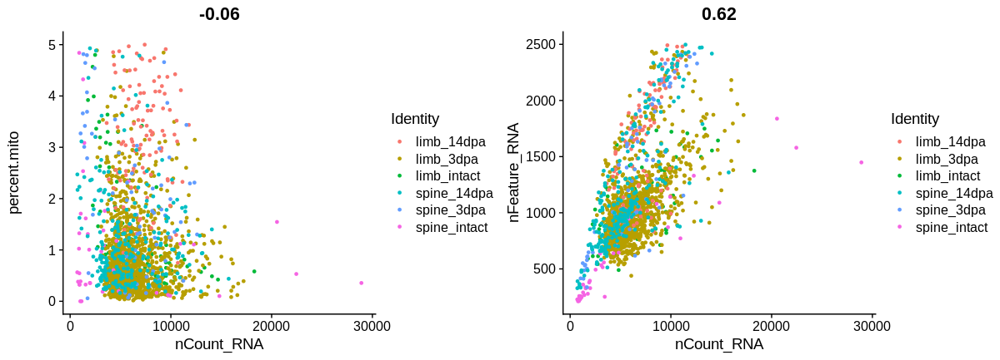
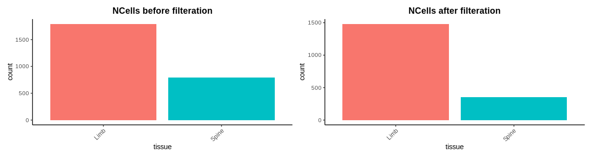
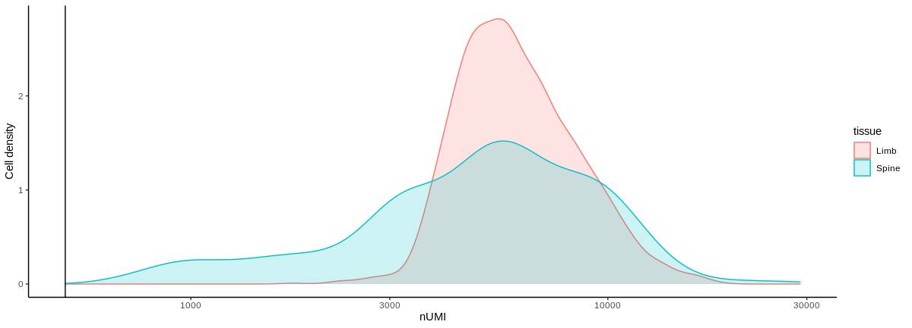
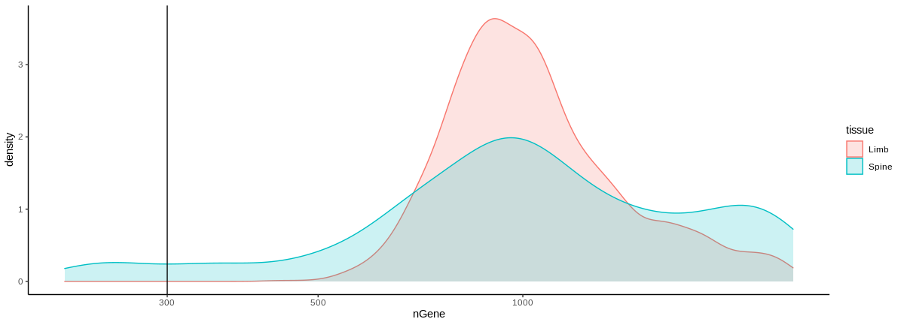
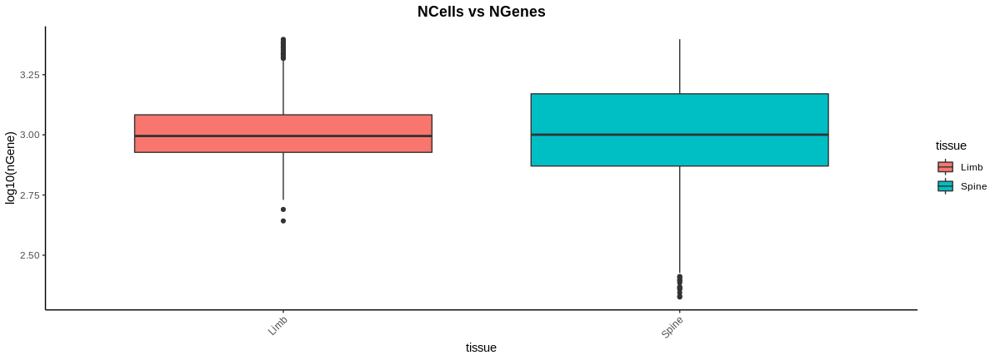
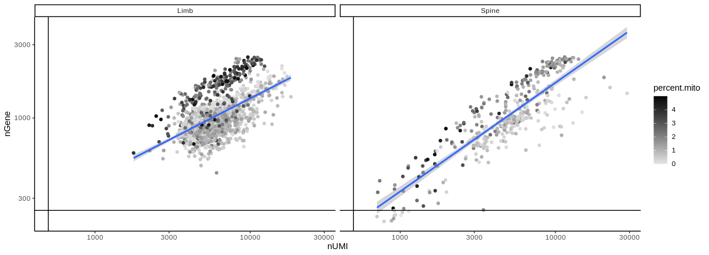
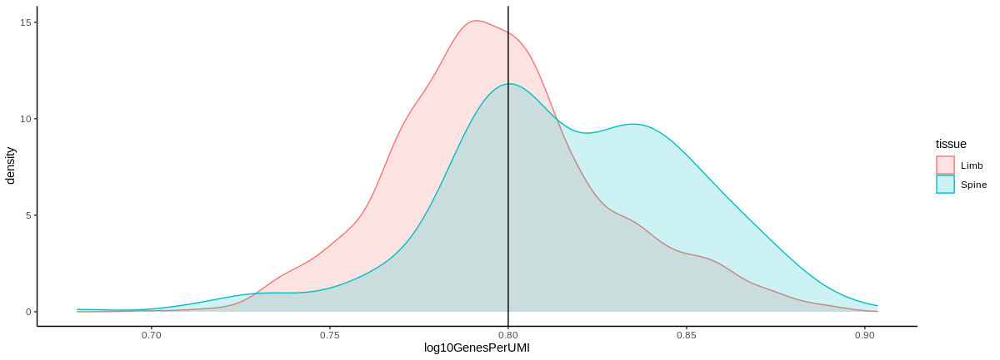

At this point we have a count matrix that Hani curated using the refactored inDrops pipeline and we have separated them into dataframe by sample type and turned them into Seurat objects as detailed in CreateSeuratObject.

# Setup the Merged Seurat Object

Merging all of the samples into one Seurat object for all downstream analysis as well as adding more metadata can be accomplished with the following command.

    seuratObject <- merge(x = limb.intact, 
                          y = c(limb.3dpa, 
                                limb.14dpa, 
                                spine.intact, 
                                spine.3dpa, 
                                spine.14dpa), 
                          add.cell.id = c("limb_intact", 
                                          "limb_3dpa", 
                                          "limb_14dpa", 
                                          "spine_intact", 
                                          "spine_3dpa", 
                                          "spine_14dpa"))
    saveRDS(seuratObject, file  =  "./seurat_objects/seurat.object.rds")

Seurat adds some metadata which can be viewed with the following command.

    head(seuratObject@meta.data)

 | | orig.ident | nCount_RNA | nFeature_RNA
 |:-----------:|:-----------:|:-----------:|:-----------:|
limb_intact_S3_bcAXNP | homeostasisLimb | 5117.6 | 1025
limb_intact_S3_bcBNEK | homeostasisLimb | 2964.3 | 1017
limb_intact_S3_bcBPJU | homeostasisLimb | 3709.3 | 1208
limb_intact_S3_bcBXHT | homeostasisLimb | 2232.5 | 898
limb_intact_S3_bcCDJD | homeostasisLimb | 5913.4 | 1420
limb_intact_S3_bcCPCC | homeostasisLimb | 3870.3 | 1096
  
The first column is the cell id from the fastq data prepended with the cell ID from the object merge.  Note that the **orig.ident** metadata value was created when the individual Seurat objects were created.   The **nCount_RNA** metadata value represents the number of UMIs per cell.  **nFeature_RNA** is the number of genes detected in the cell.

We can determine how many genes are represented in total in this specific sample type with the following command.

    sum(seuratObject@meta.data$nFeature_RNA) 
    [1] 3175313

We can access information about the data in Seurat is storing by using the name function.

    names(seuratObject.14dpa) 
    [1] "RNA"

For now there is only one assay in the object, there will be more soon.  More information about this RNA object can be obtained by using the double extractor symbol.

    seuratObject[['RNA']] 
    Assay data with 23139 features for 2590 cells
    First 10 features:
    MOSC2, NAGA, GAT1B, MINT, SFPQ, RMD5B, PTPRS, BACD3, ARL1, HLX

Which, along with sum(seuratObject@meta.data$nFeature_scRNA)  tells us that this object contains **3,175,313 total genes represented amongst 23,139 features and 2590 cells**.

The different cell identities that are represented in the object can be observed with the following command.

    unique(seuratObject@meta.data[1])
    

 ||orig.ident
  |:-----------:|:-----------:|
limb_intact_S3_bcAXNP|homeostasisLimb
limb_3dpa_S1_bcAATX|limb_3dpa
limb_14dpa_S4_bcADKU|limb_14dpa
spine_intact_S4_bcABST|homeostasisSpine
spine_3dpa_S11_bcABLN|spine_3dpa
spine_14dpa_S14_bcABCU|spine_14dpa

# Quality Metrics

## But first, A Moment for UMI 

The UMI, or Unique Molecule Identifier was added to the sequence library before PCR amplification which allow them to be used in downstream analysis to identify and eliminated PCR duplicates.

*downloaded from the Harvard Chan Bioinformatics Core*

We can calculate the number of genes per UMI for the cells represented in the metadata with the formula 
$$
Genes\:per\:UMI  = \frac{\log_{10}(nFeature)} {\log_{10}(nCount)}
$$

Add number of genes per UMI for each cell to metadata

    seuratObject$log10GenesPerUMI <- log10(seuratObject$nFeature_RNA) / log10(seuratObject$nCount_RNA)
    head(seuratObject@meta.data)

 ||orig.ident|nCount_scRNA|nFeature_scRNA|log10GenesPerUMI
 |:--:|:--:|:--:|:--:|:--:|
limb_intact_S3_bcAXNP|homeostasisLimb|5117.6|1025|0.8117201
limb_intact_S3_bcBNEK|homeostasisLimb|2964.3|1017|0.8661833
limb_intact_S3_bcBPJU|homeostasisLimb|3709.3|1208|0.8634953
limb_intact_S3_bcBXHT|homeostasisLimb|2232.5|898|0.8818932
limb_intact_S3_bcCDJD|homeostasisLimb|5913.4|1420|0.8357435
limb_intact_S3_bcCPCC|homeostasisLimb|3870.3|1096|0.8472762

### PercentageFeatureSet()
Seurat can calculate the proportion of transcripts mapping to mitochondrial genes using the PercentageFeatureSet function.
$$
Plotting\:ratio  = \frac{\sum\:set\:features} {\sum\:all\:features} 
$$

### Compute percent mito ratio
The  reads that map to mitochondrial genome are identified and used as a metric because they often appear in dying or low quality cells. 

    # Compute percent mito ratio
        seuratObject[["percent.mito"]] <- 
          PercentageFeatureSet(
            seuratObject, 
            features = c("CYB", "CYC", "COX1", "COX3", "ATP6", "NU1M", "NU5M", "NU5M")
            )
        metadata <- seuratObject@meta.data

We can view mito gene or visualize it.

    head(seuratObject@meta.data)

||orig.ident | nCount_RNA | nFeature_RNA | log10GenesPerUMI | mitoRatio
|:--:|:--:|:--:|:--:|:--:|:--:|
limb_intact_S3_bcAXNP | homeostasisLimb | 5117.6 | 1025 | 0.8117201 | 1.836798
limb_intact_S3_bcBNEK | homeostasisLimb | 2964.3 | 1017 | 0.8661833 | 2.631313
limb_intact_S3_bcBPJU | homeostasisLimb | 3709.3 | 1208 | 0.8634953 | 3.636805
limb_intact_S3_bcBXHT | homeostasisLimb | 2232.5 | 898 | 0.8818932 | 4.568869
limb_intact_S3_bcCDJD | homeostasisLimb | 5913.4 | 1420 | 0.8357435 | 1.655562
limb_intact_S3_bcCPCC | homeostasisLimb | 3870.3 | 1096 | 0.8472762 | 2.609617

### Visualize the QC metrics   
The QC metrics can be visualized as a violin plot

    VlnPlot(
      seuratObject, 
      features = c("nFeature_RNA", "nCount_RNA", "percent.mito"), 
      ncol = 3)

We can visualize the relationships between the samples using the Seurat scatterplot function FeatureScatter.

    plot1 <- FeatureScatter(seuratObject, feature1 = "nCount_RNA", feature2 = "percent.mito")
    plot2 <- FeatureScatter(seuratObject, feature1 = "nCount_RNA", feature2 = "nFeature_RNA")
    CombinePlots(plots = list(plot1, plot2))
    rm(plot1, plot2)

The **nCount_RNA** is the UMIs per cell while **nFeature_RNA** is the genes per cell.  **percent.mito** represents the percentage of genes that belong to the mitochondrial genome.  The scatterplot in the above right shows the UMI/Cell ratio, indicating possible duplication in the dataset.  

We filtered the cells that have unique counts over 2500 or less than 200, as well as any cells that have greater than 5% mitochondrial counts before plotting again for comparison.

    seuratObject <- subset(seuratObject, subset = nFeature_RNA > 200 & nFeature_RNA < 2500)

## Metadata and QC Metrics
The best method to continue creating QC metrics about the dataset will involve separating the metadata, adding metrics to it, and then replacing it it.  

    # Create metadata dataframe
    metadata <- seuratObject@meta.data
    
    # Add cell IDs to metadata
    metadata$cells <- rownames(metadata)
    
    # Rename columns
    metadata <- metadata %>%
      dplyr::rename(seq_folder = orig.ident,
                    nUMI = nCount_RNA,
                    nGene = nFeature_RNA)
    
    # Create sample column
    metadata$tissue <- metadata$seq_folder
    metadata$tissue[which(str_detect(metadata$cells, "^limb_"))] <- "Limb"
    metadata$tissue[which(str_detect(metadata$cells, "^spine_"))] <- "Spine"
    
    # Add metadata back to Seurat object
    seuratObject@meta.data <- metadata

We created a bar plot that shows the number of cell counts per sample.  It was lower than expected so a second bar plot was made with the dataset before the filtration was done to compare.

    # Visualize the number of cell counts per sample
    p2 <- metadata %>% 
      ggplot(aes(x=tissue, fill=tissue)) + 
      geom_bar() +
      theme_classic() +
      theme(axis.text.x = element_text(angle = 45, vjust = 1, hjust=1)) +
      theme(plot.title = element_text(hjust=0.5, face="bold")) +
      ggtitle("NCells postfilter")
    
    p1 + p2

The results of this graph are concerning.  Hoped to have as close to 5000 cells per sample as possible.  Limb samples have under 1500 ncells and spine is well under 500.  However, compared to the cells per sample bar plot (left) it is not statistically significant. 
## UMI counts (transcripts) per cell

The UMI counts per cell should generally be above 500.  If UMI counts are between 500-1000 counts, it is usable but the cells probably should have been sequenced more deeply.

    metadata %>% 
      ggplot(aes(color=tissue, x=nUMI, fill= tissue)) + 
      geom_density(alpha = 0.2) + 
      scale_x_log10() + 
      theme_classic() +
      ylab("Cell density") +
      geom_vline(xintercept = 500)

The majority of our cells in both limb and spine samples are well over 1000 UMI's or greater which is desirable.

## Genes detected per cell
For high quality data, the proportional histogram should contain **a single large peak that represents cells that were encapsulated**.  If we see a small shoulder to the right of the major peak (which is present in our spine data) or a bimodal distribution of the cells then likely there are **cells that failed**  for some reason.  It could mean there are **biologically different types of cells** (quiescent cell populations, less complex cells of interest).

    # Visualize the distribution of genes detected per cell via histogram
    metadata %>% 
      ggplot(aes(color=tissue, x=nGene, fill= tissue)) + 
      geom_density(alpha = 0.2) + 
      theme_classic() +
      scale_x_log10() + 
      geom_vline(xintercept = 300)

The spine samples do have a small bump to the right of the major peak.  I suspect this is due to significant differences in the type of tissue that was present in the samples.

    # Visualize the distribution of genes detected per cell via boxplot
    metadata %>% 
      ggplot(aes(x=tissue, y=log10(nGene), fill=tissue)) + 
      geom_boxplot() + 
      theme_classic() +
      theme(axis.text.x = element_text(angle = 45, vjust = 1, hjust=1)) +
      theme(plot.title = element_text(hjust=0.5, face="bold")) +
      ggtitle("NCells vs NGenes")

## UMIs vs. genes detected

Now we plot the number of genes versus the UMIs colored by the fraction of mito reads.  Mito read fractions are represented by the dots and are light blue if high in particular if the count cells are low with few detected genes (not present in this data).  This would indicate damaged or dying cells with leaky cytoplasmic mRNA.  

Poor quality cells with low genes and UMI per cell are showns in the bottom left quadrant of the plot.  Good cells generally exhibit both high number of genes per cell and higher UMIs.

The slope of the line and scatter of data points in the bottom right hand quadrant of the plot indicate high UMI but low number of genes.  This could represent population of lower complexity celltype such as red blood cells.

    # Visualize the correlation between genes detected and number of UMIs and determine whether strong presence of cells with low numbers of genes/UMIs
    metadata %>% 
      ggplot(aes(x=nUMI, y=nGene, color=percent.mito)) + 
      geom_point() + 
      scale_colour_gradient(low = "gray90", high = "black") +
      stat_smooth(method=lm) +
      scale_x_log10() + 
      scale_y_log10() + 
      theme_classic() +
      geom_vline(xintercept = 500) +
      geom_hline(yintercept = 250) +
      facet_wrap(~tissue)

Our spine data has very little low quality celltypes indicated most of the data being in the top-right quadrant.  

## Mitochondrial counts ratio
We can identify if there is a large amount of mitochondrial contamination from dead or dying cells using a histogram.  We define "poor quality" samples for mito counts as cells which surpass the 0.2 mito ratio mark.

    metadata %>% 
      ggplot(aes(color=tissue, x=percent.mito/100, fill=tissue)) + 
      geom_density(alpha = 0.2) + 
      scale_x_log10() + 
      theme_classic() +
      geom_vline(xintercept = 0.2)

This indicates that there is not a considerable amount of mitochondrial contamination in our data.

## Complexity

Plotting the complexity of the genes we would expect to find the data to be past the threshold of 0.8.  

    # Visualize the overall complexity of the gene expression by visualizing the genes detected per UMI
    metadata %>%
      ggplot(aes(x=log10GenesPerUMI, color = tissue, fill=tissue)) +
      geom_density(alpha = 0.2) +
      theme_classic() +
      geom_vline(xintercept = 0.8)

Our data overall is not very complex, however it trends positively in every other way.

#
R version 4.0.3 (2020-10-10)
Platform: x86_64-pc-linux-gnu (64-bit)
Running under: Ubuntu 18.04.5 LTS

Matrix products: default
BLAS:   /usr/lib/x86_64-linux-gnu/atlas/libblas.so.3.10.3
LAPACK: /usr/lib/x86_64-linux-gnu/atlas/liblapack.so.3.10.3

locale:
[1] LC_CTYPE=en_US.UTF-8       LC_NUMERIC=C               LC_TIME=en_US.UTF-8       
[4] LC_COLLATE=en_US.UTF-8     LC_MONETARY=en_US.UTF-8    LC_MESSAGES=en_US.UTF-8   
[7] LC_PAPER=en_US.UTF-8       LC_NAME=C                  LC_ADDRESS=C              
[10] LC_TELEPHONE=C             LC_MEASUREMENT=en_US.UTF-8 LC_IDENTIFICATION=C       

attached base packages:
[1] parallel  stats     graphics  grDevices utils     datasets  methods   base     

other attached packages:
[1] ape_5.4-1           metap_1.4           multtest_2.44.0     Biobase_2.48.0      BiocGenerics_0.34.0
[6] cowplot_1.1.0       RCurl_1.98-1.2      dplyr_1.0.2       stringr_1.4.0       purrr_0.3.4        
[11] Seurat_3.2.2         tidyr_1.1.2         tibble_3.0.4        tidyverse_1.3.0     ggplot2_3.3.2      